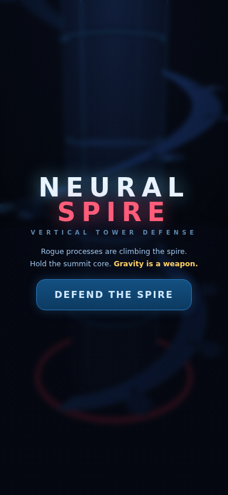
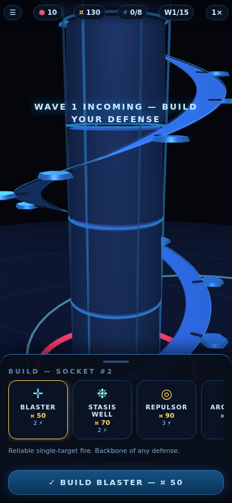

# NEURAL SPIRE

**▶ Play: https://shaumik.github.io/ai-tower/**

Vertical tower defense built with Three.js for the **MHCP Creator Competition**
(Tower Defense & Strategy). Single-player, portrait, zero network requests.

The map is a literal tower: rogue processes climb a helical ramp toward the
summit core, and you mount defenses on sockets spiraling up the outside.
**Gravity is a weapon** — Repulsor turrets hurl climbers off the spire, and
fall height pays a salvage bonus. The spire blocks its own defenses (no
shooting through the column), fliers skip the ramp entirely, and the economy
runs on three interlocking systems: salvage + interest on reserves, a hard
power grid fed by socket-hungry generators, and overclock bursts.

| | | |
|---|---|---|
|  |  |  |

## Competition submission

The three MHCP artefacts:

1. **Playable build** — `python3 tools/build_competition.py` assembles the
   modular sources (`css/`, `js/`) into a single readable, unminified
   `dist/index.html` and packages `dist/neural-spire-mhcp.zip`
   (index.html at the zip's top level; Three.js in `vendor/`, referenced
   with a relative path).
2. **Design Intent** — `submission/design-intent.docx`
3. **Build Log** — `BUILD_LOG.md`

## Development

Sources are modular for development: `js/*.js` + `css/style.css`, loaded by
the root `index.html`; `vendor/three.min.js` is the only dependency. Open
`index.html` with any static server or straight from `file://` — there is no
build step for dev.
