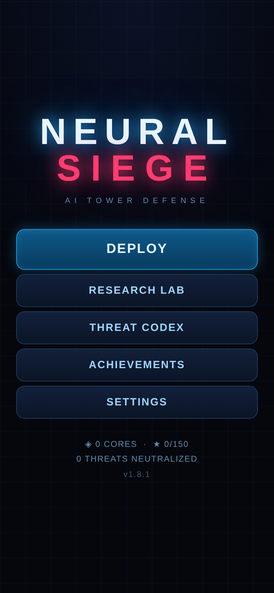
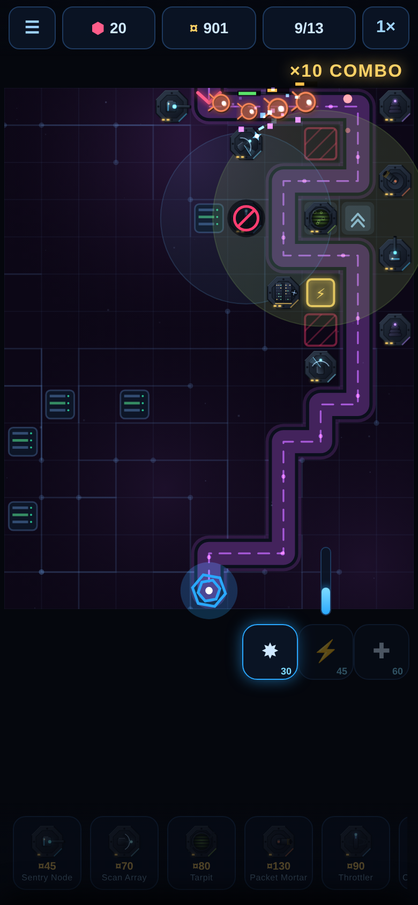
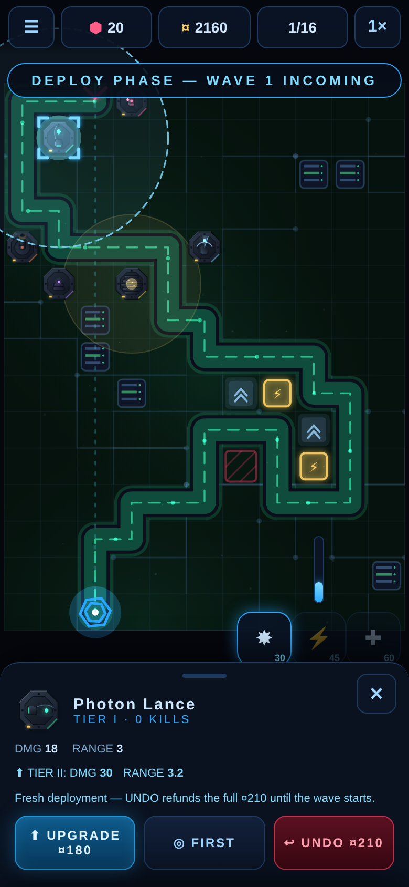

# NEURAL SIEGE

**▶ Play: https://shaumik.github.io/ai-tower/**

AI-themed tower defense, built for the **MHCP Creator Competition** (Tower
Defense & Strategy). Single-player, portrait, pure HTML5 canvas — no engine,
no external assets, zero network requests at runtime.

50 levels, 32 enemy types, 5 sector bosses, 12 tower families with tier-3
branch specializations — build between waves, then watch your defense hold.
Damage types with weaknesses and resistances, terrain tiles, pre-wave deals,
spreading corruption, and status combos keep every node fresh.

| | | |
|---|---|---|
|  |  |  |

## Competition submission

The three MHCP artefacts:

1. **Playable build** — `python3 tools/build_competition.py` assembles the
   modular sources (`css/`, `js/`) into a single readable, unminified
   `dist/index.html` and packages `dist/neural-siege-mhcp.zip`
   (index.html at the zip's top level; no third-party libraries used).
2. **Design Intent** — `submission/design-intent.docx`
3. **Build Log** — `BUILD_LOG.md`

## Development

Sources are modular for development: `js/*.js` + `css/style.css`, loaded by
the root `index.html`. Open it with any static server (or `file://`) — there
is no build step for dev. `mock.html` is the art-direction sandbox used to
iterate the visual style.
