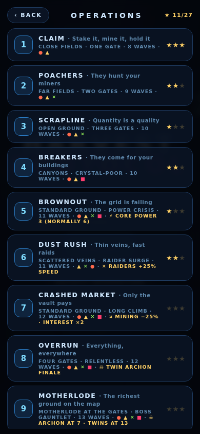
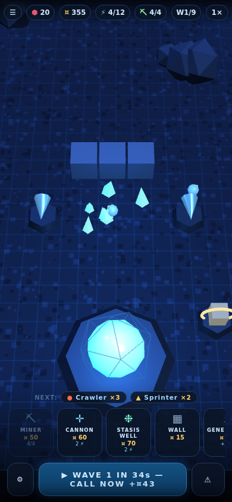
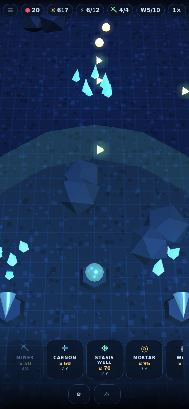

# HARVEST PROTOCOL

**▶ Play: https://shaumik.github.io/ai-tower/**

RTS-economy base defense built with Three.js for the **MHCP Creator
Competition** (Tower Defense & Strategy). Single-player, portrait, zero
network requests.

**The economy is the battlefield.** Income is mined, not earned per kill:
harvester drones shuttle crystal loads from finite fields to your drop-offs,
so worker count is income rate — and raiders ignore your core to hunt the
miners instead. Every StarCraft macro question ports over: another miner or
another cannon? Expand a depot toward the rich far field, or milk the safe
one? Fields visibly shrink as they drain, forcing expansion onto worse
ground mid-run.

Defense is physical: walls block ground routes and get broken, brutes siege
structures, buildings hold integrity and want repair minerals, and a hard
power grid caps how many turrets can run. On top: interest on unspent
minerals, pick-one wave directives, and the CORE OS tech tree competing with
your next turret for the same minerals.

**Nine authored operations** (fixed layouts, learnable), each adding one
element through an isolated showcase wave or bending one rule — power
crisis, raider surge, inverted market, the motherlode parked beside the
enemy gates. Encounter-budget waves with authored pacing; ARCHON bosses
smash through walls. Three-star ratings, sequential unlocks, persistent
progress.

| | | |
|---|---|---|
|   |  |  |

## Competition submission

The three MHCP artefacts:

1. **Playable build** — `python3 tools/build_competition.py` assembles the
   modular sources (`css/`, `js/`) into a single readable, unminified
   `dist/index.html` and packages `dist/harvest-protocol-mhcp.zip`
   (index.html at the zip's top level; Three.js in `vendor/`, referenced
   with a relative path).
2. **Design Intent** — `submission/design-intent.docx`
3. **Build Log** — `BUILD_LOG.md`

## Development

Sources are modular for development: `js/*.js` + `css/style.css`, loaded by
the root `index.html`; `vendor/three.min.js` is the only dependency. Open
`index.html` with any static server or straight from `file://` — there is no
build step for dev.
