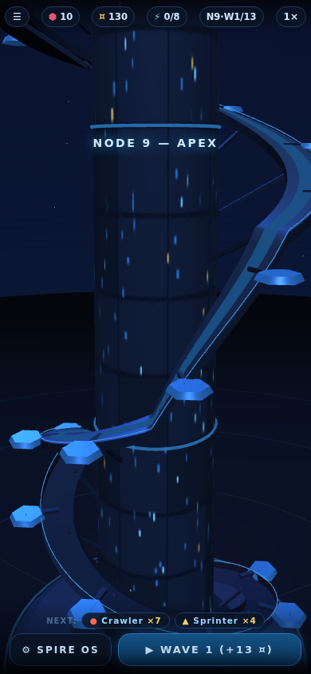

# NEURAL SPIRE

**▶ Play: https://shaumik.github.io/ai-tower/**

Vertical tower defense built with Three.js for the **MHCP Creator Competition**
(Tower Defense & Strategy). Single-player, portrait, zero network requests.

The map is a literal tower. Rogue processes climb a winding ramp toward the
summit core; you mount defenses on sockets spiraling up the outside.
**Gravity is a weapon** — Repulsor turrets hurl climbers off the spire, and
fall height pays a salvage bonus. The spire blocks its own defenses (no
shooting through the column) and fliers skip the ramp entirely.

**A nine-node authored campaign**, built on classic TD level-design
structure: each node is a fixed, learnable spire with its own topology
(wide teaching spiral → short steep socket-starved climbs → the APEX
megaspire), a threat palette that grows one element at a time with isolated
showcase waves, twist nodes that bend the rules (power crisis, flier
updraft, inverted economy), and encounter-budget waves with authored pacing
— openers, surge beats, a breather before every finale, scripted bosses.
Three-star ratings (3★ = zero leaks), sequential unlocks, persistent
progress.

The economy is the second front: salvage + interest on reserves, a hard
power grid fed by socket-hungry generators, pick-one wave directives
(Bull Market, War Bonds, Insurance…), the SPIRE OS tech tree, overclock
bursts, and a wave-end income report.

| | | |
|---|---|---|
|  |  |  |

## Competition submission

The three MHCP artefacts:

1. **Playable build** — `python3 tools/build_competition.py` assembles the
   modular sources (`css/`, `js/`) into a single readable, unminified
   `dist/index.html` and packages `dist/neural-spire-mhcp.zip`
   (index.html at the zip's top level; Three.js in `vendor/`, referenced
   with a relative path).
2. **Design Intent** — `submission/design-intent.docx`
3. **Build Log** — `BUILD_LOG.md`

## Development

Sources are modular for development: `js/*.js` + `css/style.css`, loaded by
the root `index.html`; `vendor/three.min.js` is the only dependency. Open
`index.html` with any static server or straight from `file://` — there is no
build step for dev.
